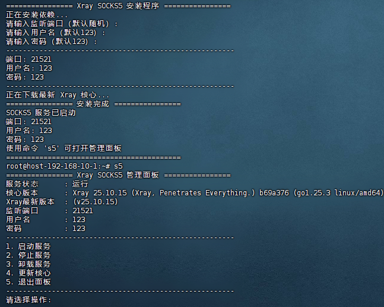

# OneClick-socks5
一键安装 SOCKS5 服务管理面板，简单易用

## 特性

- 一键安装，自动配置 Xray 核心
- 支持自定义端口、用户名、密码（可使用默认/随机）
- 系统服务管理（启动/停止/卸载/更新核心）
- 管理面板显示服务状态（运行/关闭）、核心版本、新版本提示、端口、账号信息
- 自动检查是否有新版本 Xray 核心
- 适合 Debian / Ubuntu / CentOS / RHEL 系统

## 一键安装

```bash
wget -O s5.sh https://raw.githubusercontent.com/lillinlin/OneClick-socks5/main/s5.sh && chmod +x s5.sh && ./s5.sh
```


  
